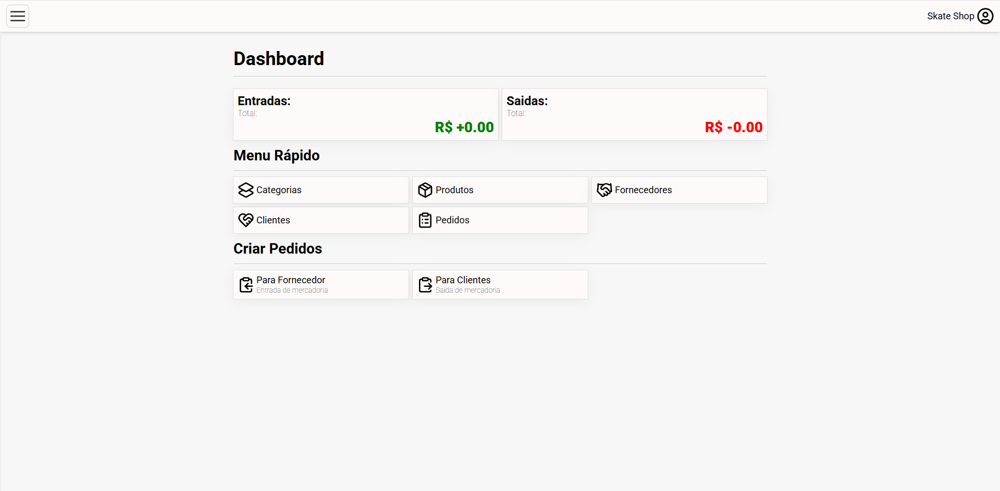

# Orpheu
> Um sistema de gerenciamento e controle de estoque projetado para simplificar a administração de pequenos negócios, oferecendo ferramentas eficientes para acompanhar produtos, vendas e estoque. 

## 📋 Índice  
- [Sobre o Projeto](#-sobre-o-projeto)  
- [Demonstração](#-demonstração)  
- [Tecnologias Utilizadas](#-tecnologias-utilizadas)  
- [Instalação e Uso](#pré-requisitos)  
- [Contato](#-contato) 

## 💡 Sobre o Projeto  
O **Orpheu** é um sistema de gerenciamento e controle de estoque desenvolvido para simplificar a administração de pequenos negócios. Com uma interface intuitiva e ferramentas eficientes, a aplicação permite acompanhar produtos, monitorar vendas e gerenciar o estoque de forma prática e organizada.

## 🚀 Demonstração  

#### 🔗 Demonstração completa: [Em breve]()

## 🛠 Tecnologias Utilizadas  
O projeto foi desenvolvido com as seguintes tecnologias:  

- [Java](https://www.java.com/pt-BR/)
- [Spring Boot](https://spring.io/projects/spring-boot)
- [Spring Security](https://spring.io/projects/spring-security)
- [Spring Data JPA](https://spring.io/projects/spring-data-jpa)
- [Lombok](https://projectlombok.org/)
- [MapStruct](https://mapstruct.org/)
- [MySQL](https://www.mysql.com/)
- [Next.js](https://nextjs.org/)
- [Context API](https://react.dev/reference/react/createContext)
- [React Hook Form](https://www.react-hook-form.com/)
- [Axios](https://axios-http.com/ptbr/)
- [Sass](https://sass-lang.com/)

## Pré-requisitos  
Certifique-se de ter as seguintes ferramentas instaladas:  
- [Java](https://www.java.com/pt-BR/) version 17^ 
- [Node.js](https://nodejs.org/)  
- [Yarn](https://yarnpkg.com/) ou [npm](https://yarnpkg.com/) 

## 📬 Contato
📧 Email: guilherme.ap404@gmail.com
🌎 LinkedIn: https://www.linkedin.com/in/guilherme-faria-dev/